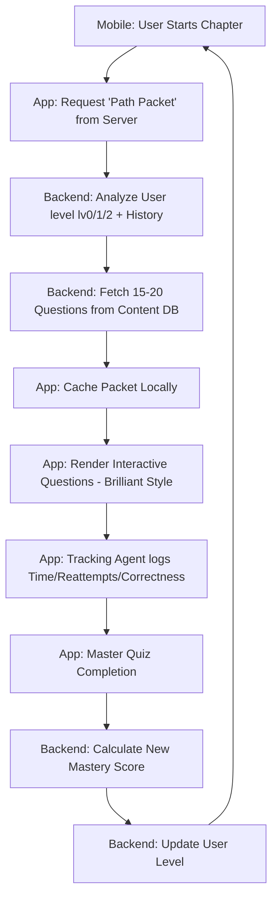

# GyanX Content & Recommendation Engine: Technical Architecture

This document serves as the **Knowledge Transfer (KT)** bridge between the **Main Mobile App (Flutter)** and the **Content Engine / Admin Repo**. 

## 1. System Logic Flow
The user journey follows a circular "Mastery Loop." No decisions are made in isolation; every user action informs the next content batch.



---

## 2. Communication Contract (API Architecture)
The Mobile App expects three primary interaction points from the new Content Engine backend.

### A. GET `/path/generate`
Fetches a batch of questions to prevent latency.
*   **Request**: `child_id`, `subject_id`, `chapter_id`.
*   **Response**: 
```json
{
  "chapter_id": "math_01",
  "level": "lv1",
  "questions": [
    {
      "id": "q_101",
      "type": "slider_interaction",
      "data": { ... interactive_config ... },
      "difficulty": 0.4
    }
  ]
}
```

### B. POST `/tracking/sync`
Sends the local performance data collected during the chapter.
*   **Payload**:
    *   `time_ms`: Duration from load to success.
    *   `attempts`: Number of failed "Check" clicks.
    *   `hints_used`: Boolean or Count.

### C. GET `/parent/dashboard/{child_id}`
Provides the aggregated analytics for the Parent View.

---

## 3. Interactive Content Schema (DSL)
To achieve the **"Brilliant"** look, questions must be transmitted as a **Domain Specific Language (DSL)** that the Flutter App's renderer can parse.

| Format | Interaction Logic |
| :--- | :--- |
| **`interactive_graph`** | User drags a point on a parabola to hit a target. |
| **`step_by_step`** | Content reveals only after the user solves a micro-task. |
| **`logic_puzzle`** | Drag-and-drop elements to complete a sequence. |
| **`slider_simulation`** | Adjusting a slider updates a real-time SVG diagram (e.g., Physics). |

---

## 4. Design & Branding Tokens
For the Content Engine to "know" how to format snippets (if it generates HTML or SVGs), it must adhere to these tokens:

*   **Primary Purple**: `#8A5CFF` (Accent, Buttons, Progress)
*   **Success Green**: `#4EB679` (Correct Answers)
*   **Warning Yellow**: `#FEC61F` (Hints/Alerts)
*   **Info Blue**: `#1DAAF4` (Secondary actions)
*   **Font**: Inter / Outfit (Clean, modern sans-serif)

---

## 5. Master Quiz Evaluation Formula
The Content Engine must implement the logic to elevate or demote a user after a chapter.

**Proposed Logic:**
1.  **Level Up**: Accuracy > 90% AND Time < Median.
2.  **Stay Level**: Accuracy 70-90% OR High Reattempts.
3.  **Level Down (Hidden)**: Accuracy < 50% AND Time > 2x Median. *Note: The user is never told they "leveled down," they just receive more foundational content.*

---

## 🏗️ Next Steps for the Content Repo Team
1.  **Database Design**: Relational DB (PostgreSQL) recommended for mapping Questions -> Topics -> Levels.
2.  **Admin UI**: React-based dashboard for "Brilliant-style" question building.
3.  **Analytics Pipeline**: Real-time aggregation of the `/tracking/sync` data.
